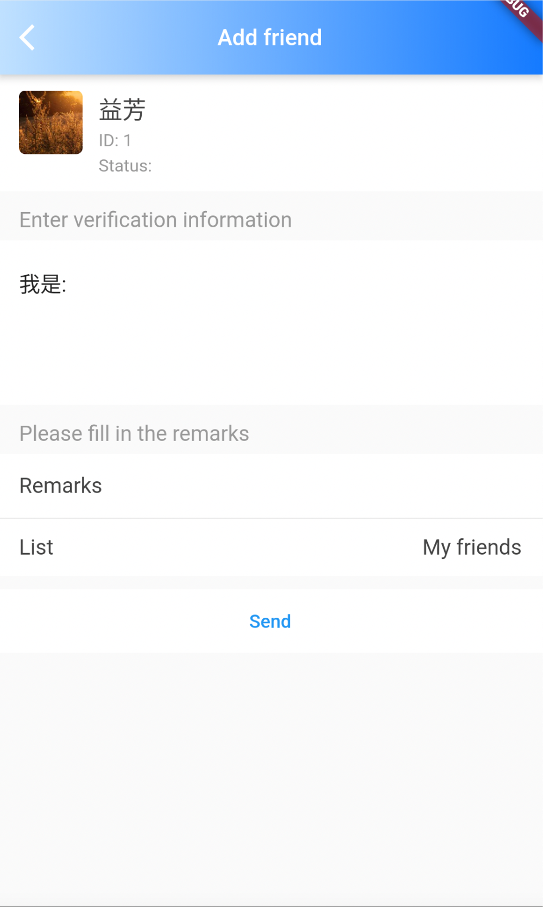

# TIMUIKitAddFriend

## 组件介绍及使用场景 <a href="#he-shi-shi-yong" id="he-shi-shi-yong"></a>

组件介绍：添加好友组件。

使用场景：添加好友时使用。

## 参数列表

| 参数                      | 说明                     | 类型                                          | 是否必填 |
| ----------------------- | ---------------------- | ------------------------------------------- | ---- |
| isShowDefaultGroup      | 发送好友申请页面是否展示用户被添加的默认分组 | bool                                        | 否    |
| onTapAlreadyFriendsItem | 当添加已经是好友的用户时的函数        | Function(String userID)                     | 是    |
| lifeCycle               | 添加好友操作时的钩子函数           | [AddFriendLifeCycle](AddFriendLifeCycle.md) | 否    |

## 代码示例与效果展示

### isShowDefaultGroup

isShowDefaultGroup决定了在发送好友申请页面是否展示用户被添加的默认分组。

#### 代码示例

```dart
@override
  Widget build(BuildContext context) {
    final theme = Provider.of<DefaultThemeData>(context).theme;
    return Scaffold(
      appBar: AppBar(
          title: Text(
            imt("添加好友"),
            style: const TextStyle(color: Colors.white, fontSize: 17),
          ),
          shadowColor: theme.weakDividerColor,
          flexibleSpace: Container(
            decoration: BoxDecoration(
              gradient: LinearGradient(colors: [
                theme.lightPrimaryColor ?? CommonColor.lightPrimaryColor,
                theme.primaryColor ?? CommonColor.primaryColor
              ]),
            ),
          ),
          iconTheme: const IconThemeData(
            color: Colors.white,
          )),
      body: TIMUIKitAddFriend(
        isShowDefaultGroup: true,
        onTapAlreadyFriendsItem: (String userID) {
          Navigator.push(
              context,
              MaterialPageRoute(
                builder: (context) => UserProfile(userID: userID),
              ));
        },
      ),
    );
  }
```

#### 效果展示



### onTapAlreadyFriendsItem

onTapAlreadyFriendsItem为当添加已经是好友的用户时的函数

* 代码示例为使用onTapAlreadyFriendsItem做到当添加的用户已经是好友时，跳转到被添加的用户的用户信息页面

#### 代码示例

```dart
  @override
  Widget build(BuildContext context) {
    final theme = Provider.of<DefaultThemeData>(context).theme;
    return Scaffold(
      appBar: AppBar(
          title: Text(
            imt("添加好友"),
            style: const TextStyle(color: Colors.white, fontSize: 17),
          ),
          shadowColor: theme.weakDividerColor,
          flexibleSpace: Container(
            decoration: BoxDecoration(
              gradient: LinearGradient(colors: [
                theme.lightPrimaryColor ?? CommonColor.lightPrimaryColor,
                theme.primaryColor ?? CommonColor.primaryColor
              ]),
            ),
          ),
          iconTheme: const IconThemeData(
            color: Colors.white,
          )),
      body: TIMUIKitAddFriend(
        onTapAlreadyFriendsItem: (String userID) {
          Navigator.push(
              context,
              MaterialPageRoute(
                builder: (context) => UserProfile(userID: userID),
              ));
        },
      ),
    );
  }
```

#### 效果展示


### lifeCycle

lifeCycle为添加好友操作时的钩子函数

* 代码示例为使用shouldAddFriend做到添加好友前跳出弹窗的案例。

#### 代码示例

```dart
  
```

#### 效果展示

