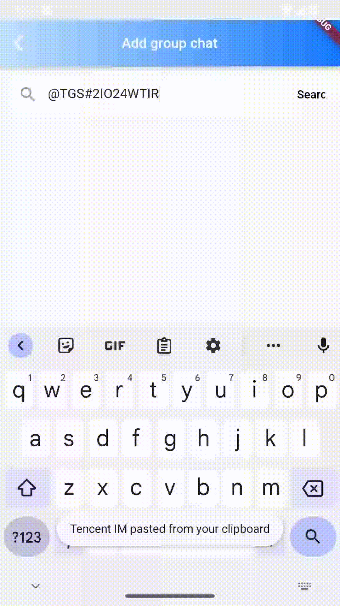

# TIMUIKitAddGroup

## 组件介绍及使用场景 <a href="#he-shi-shi-yong" id="he-shi-shi-yong"></a>

组件介绍：添加群组组件。

使用场景：添加群组时使用。

## 参数列表

| 参数              | 说明           | 类型                                                                                                               | 是否必填 |
| --------------- | ------------ | ---------------------------------------------------------------------------------------------------------------- | ---- |
| onTapExistGroup | 当添加已在群组时的函数  | Function(String groupID, [V2TimConversation](../../api/guan-jian-lei/message/v2timconversation.md) conversation) | 是    |
| lifeCycle       | 添加好友群组时的钩子函数 | [AddGroupLifeCycle](AddGroupLifeCycle.md)                                                                        | 否    |

## 代码示例与效果展示

### onTapExistGroup

onTapExistGroup当添加已在群组时的函数

* 代码示例为使用onTapExistGroup做到当用户已在需要添加的群组中时，跳转到被添加的群组的聊天页面

#### 代码示例

```dart
  @override
  Widget build(BuildContext context) {
    final theme = Provider.of<DefaultThemeData>(context).theme;
    return Scaffold(
      appBar: AppBar(
          title: Text(
            imt("添加群聊"),
            style: const TextStyle(color: Colors.white, fontSize: 17),
          ),
          shadowColor: theme.weakDividerColor,
          flexibleSpace: Container(
            decoration: BoxDecoration(
              gradient: LinearGradient(colors: [
                theme.lightPrimaryColor ?? CommonColor.lightPrimaryColor,
                theme.primaryColor ?? CommonColor.primaryColor
              ]),
            ),
          ),
          iconTheme: const IconThemeData(
            color: Colors.white,
          )),
      body: TIMUIKitAddGroup(
        onTapExistGroup: (groupID, conversation) {
          Navigator.push(
              context,
              MaterialPageRoute(
                builder: (context) => Chat(
                  selectedConversation: conversation,
                ),
              ));
        },
      ),
    );
  }
```

#### 效果展示



### lifeCycle

lifeCycle为添加群组操作时的钩子函数

* 代码示例为使用shouldAddGroup做到申请添加群组前跳出弹窗的案例。

#### 代码示例

```dart
  @override
  Widget build(BuildContext context) {
    AddGroupLifeCycle lifeCycle = AddGroupLifeCycle(
      shouldAddGroup: (String groupID, String message,
          [BuildContext? applicationContext]) async {
        //发送添加群组请求前的逻辑
        // 弹出对话框
        Future<bool?> shouldAddGroupDialog() {
          return showDialog<bool>(
            context: applicationContext!,
            builder: (applicationContext) {
              return AlertDialog(
                title: const Text("提示"),
                content: const Text("您确定要申请加入此群吗?"),
                actions: <Widget>[
                  TextButton(
                    child: const Text("取消"),
                    onPressed: () =>
                        Navigator.of(applicationContext).pop(), // 关闭对话框
                  ),
                  TextButton(
                    child: const Text("确定"),
                    onPressed: () {
                      //关闭对话框并返回true
                      Navigator.of(applicationContext).pop(true);
                    },
                  ),
                ],
              );
            },
          );
        }

        bool? isAdd = await shouldAddGroupDialog();
        return isAdd ?? false;
      },
    );
    final theme = Provider.of<DefaultThemeData>(context).theme;
    return Scaffold(
      appBar: AppBar(
          title: Text(
            imt("添加群聊"),
            style: const TextStyle(color: Colors.white, fontSize: 17),
          ),
          shadowColor: theme.weakDividerColor,
          flexibleSpace: Container(
            decoration: BoxDecoration(
              gradient: LinearGradient(colors: [
                theme.lightPrimaryColor ?? CommonColor.lightPrimaryColor,
                theme.primaryColor ?? CommonColor.primaryColor
              ]),
            ),
          ),
          iconTheme: const IconThemeData(
            color: Colors.white,
          )),
      body: TIMUIKitAddGroup(
        lifeCycle: lifeCycle,
        onTapExistGroup: (groupID, conversation) {
          Navigator.push(
              context,
              MaterialPageRoute(
                builder: (context) => Chat(
                  selectedConversation: conversation,
                ),
              ));
        },
      ),
    );
  }
```

#### 效果展示


<style>
img{ width:240px; height:400px; }
</style>
