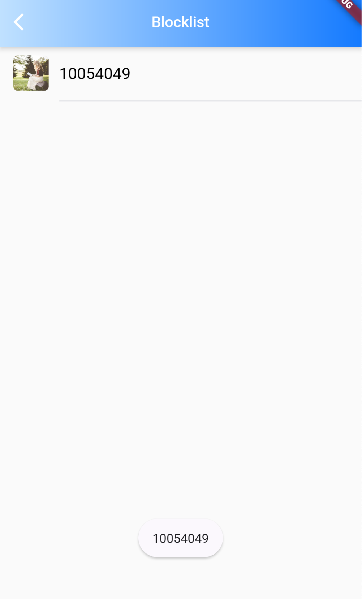
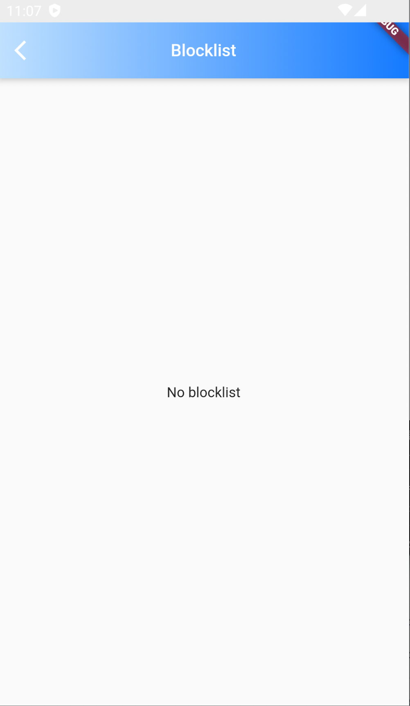
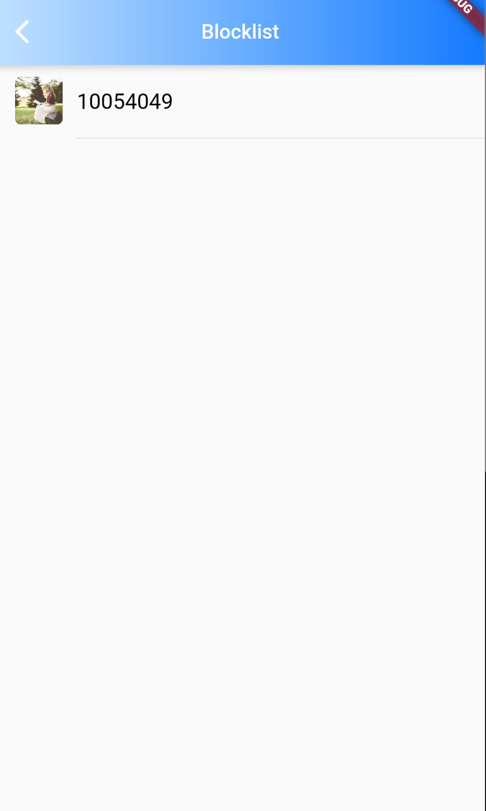

# TIMUIKitBlackList

## 组件介绍及使用场景 <a href="#he-shi-shi-yong" id="he-shi-shi-yong"></a>

组件介绍：黑名单列表组件。

使用场景：展示黑名单列表时使用。

## 参数列表

| 参数           | 说明                 | 类型                                                                                                                   | 是否必填 |
| ------------ | ------------------ | -------------------------------------------------------------------------------------------------------------------- | ---- |
| onTapItem    | 黑名单用户模块点击触发的函数     | void Function([V2TimFriendInfo](../../api/guan-jian-lei/user/v2timfriendinfo.md) groupInfo)                          | 否    |
| emptyBuilder | 黑名单无成员时的样式构造器      | Widget Function(BuildContext context)                                                                                | 否    |
| itemBuilder  | 用于自定义构建黑名单用户模块的构造器 | Widget Function( BuildContext context, [V2TimFriendInfo](../../api/guan-jian-lei/user/v2timfriendinfo.md) groupInfo) | 否    |
| lifeCycle    | 黑名单列表操作时的钩子函数      | [BlockListLifeCycle](BlockListLifeCycle.md)                                                                          | 否    |

## 代码示例与效果展示

### onTapItem

onTapItem为黑名单用户模块点击触发的函数。

* 代码示例为使用自定义onTapItem做到弹框展示黑名单用户id。

#### 代码示例

```dart
  @override
  Widget build(BuildContext context) {
    final theme = Provider.of<DefaultThemeData>(context).theme;
    return Scaffold(
      appBar: AppBar(
          title: Text(
            imt("黑名单"),
            style: const TextStyle(color: Colors.white, fontSize: 17),
          ),
          shadowColor: Colors.white,
          flexibleSpace: Container(
            decoration: BoxDecoration(
              gradient: LinearGradient(colors: [
                theme.lightPrimaryColor ?? CommonColor.lightPrimaryColor,
                theme.primaryColor ?? CommonColor.primaryColor
              ]),
            ),
          ),
          iconTheme: const IconThemeData(
            color: Colors.white,
          )),
      body: TIMUIKitBlackList(
        emptyBuilder: (_) {
          return Center(
            child: Text(imt("暂无黑名单")),
          );
        },
        onTapItem: (V2TimFriendInfo fiiendInfo) {
          Utils.toast(fiiendInfo.userID);
        },
      ),
    );
  }
```

#### 效果展示



### emptyBuilder

emptyBuilder决定了当用户黑名单列表为空时黑名单列表页面的样式。

* 代码示例为使用自定义emptyBuilder展示暂无黑名单的页面样式。

#### 代码示例

```dart
  @override
  Widget build(BuildContext context) {
    final theme = Provider.of<DefaultThemeData>(context).theme;
    return Scaffold(
      appBar: AppBar(
          title: Text(
            imt("黑名单"),
            style: const TextStyle(color: Colors.white, fontSize: 17),
          ),
          shadowColor: Colors.white,
          flexibleSpace: Container(
            decoration: BoxDecoration(
              gradient: LinearGradient(colors: [
                theme.lightPrimaryColor ?? CommonColor.lightPrimaryColor,
                theme.primaryColor ?? CommonColor.primaryColor
              ]),
            ),
          ),
          iconTheme: const IconThemeData(
            color: Colors.white,
          )),
      body: TIMUIKitBlackList(
        emptyBuilder: (_) {
          return Center(
            child: Text(imt("暂无黑名单")),
          );
        },
        onTapItem: (_) {},
      ),
    );
  }
```

#### 效果展示



### itemBuilder

itemBuilder为用于自定义构建黑名单用户模块的构造器

* 代码示例为使用自定义itemBuilder展示黑名单用户信息

#### 代码示例

```dart
  @override
  Widget build(BuildContext context) {
    final TUIFriendShipViewModel _friendshipViewModel =
        serviceLocator<TUIFriendShipViewModel>();
    final theme = Provider.of<DefaultThemeData>(context).theme;

    _getShowName(V2TimFriendInfo item) {
      final friendRemark = item.friendRemark ?? "";
      final nickName = item.userProfile?.nickName ?? "";
      final userID = item.userID;
      final showName = nickName != "" ? nickName : userID;
      return friendRemark != "" ? friendRemark : showName;
    }

    Widget _itemBuilder(BuildContext context, V2TimFriendInfo friendInfo) {
      final theme = Provider.of<TUIThemeViewModel>(context).theme;
      final showName = _getShowName(friendInfo);
      final faceUrl = friendInfo.userProfile?.faceUrl ?? "";
      return Slidable(
        endActionPane: ActionPane(motion: const DrawerMotion(), children: [
          SlidableAction(
            onPressed: (context) async {
              await _friendshipViewModel
                  .deleteFromBlockList([friendInfo.userID]);
            },
            backgroundColor: theme.cautionColor ?? CommonColor.cautionColor,
            foregroundColor: Colors.white,
            label: TIM_t("删除"),
            autoClose: true,
          )
        ]),
        child: Container(
          padding: const EdgeInsets.only(top: 10, left: 16),
          child: Row(
            children: [
              Container(
                padding: const EdgeInsets.only(bottom: 12),
                margin: const EdgeInsets.only(right: 12),
                child: SizedBox(
                  height: 40,
                  width: 40,
                  child: Avatar(faceUrl: faceUrl, showName: showName),
                ),
              ),
              Expanded(
                  child: Container(
                alignment: Alignment.centerLeft,
                padding: const EdgeInsets.only(top: 10, bottom: 20),
                decoration: BoxDecoration(
                    border: Border(
                        bottom: BorderSide(
                            color: theme.weakDividerColor ??
                                CommonColor.weakDividerColor))),
                child: Text(
                  showName,
                  style: const TextStyle(color: Colors.black, fontSize: 18),
                ),
              ))
            ],
          ),
        ),
      );
    }

    return Scaffold(
      appBar: AppBar(
          title: Text(
            imt("黑名单"),
            style: const TextStyle(color: Colors.white, fontSize: 17),
          ),
          shadowColor: Colors.white,
          flexibleSpace: Container(
            decoration: BoxDecoration(
              gradient: LinearGradient(colors: [
                theme.lightPrimaryColor ?? CommonColor.lightPrimaryColor,
                theme.primaryColor ?? CommonColor.primaryColor
              ]),
            ),
          ),
          iconTheme: const IconThemeData(
            color: Colors.white,
          )),
      body: TIMUIKitBlackList(
        itemBuilder: _itemBuilder,
        emptyBuilder: (_) {
          return Center(
            child: Text(imt("暂无黑名单")),
          );
        },
        onTapItem: (_) {},
      ),
    );
  }
```

#### 效果展示



### lifeCycle

lifeCycle为用户信息操作时的钩子函数

* 代码示例为使用shouldDeleteFromBlockList做到移出黑名单前跳出弹窗的案例。

#### 代码示例

```dart
  @override
  Widget build(BuildContext context) {
    final theme = Provider.of<DefaultThemeData>(context).theme;
    BlockListLifeCycle lifeCycle = BlockListLifeCycle(
      shouldDeleteFromBlockList: (List<String> userIDList) async {
        // 移出黑名单前的逻辑
        // 弹出对话框
        Future<bool?> shouldDeleteFromBlockListDialog() {
          return showDialog<bool>(
            context: context,
            builder: (context) {
              return AlertDialog(
                title: const Text("提示"),
                content: const Text("您确定要将此用户移出黑名单吗?"),
                actions: <Widget>[
                  TextButton(
                    child: const Text("取消"),
                    onPressed: () => Navigator.of(context).pop(), // 关闭对话框
                  ),
                  TextButton(
                    child: const Text("确定"),
                    onPressed: () {
                      //关闭对话框并返回true
                      Navigator.of(context).pop(true);
                    },
                  ),
                ],
              );
            },
          );
        }

        bool? isDelete = await shouldDeleteFromBlockListDialog();
        return isDelete ?? false;
      },
    );
    return Scaffold(
      appBar: AppBar(
          title: Text(
            imt("黑名单"),
            style: const TextStyle(color: Colors.white, fontSize: 17),
          ),
          shadowColor: Colors.white,
          flexibleSpace: Container(
            decoration: BoxDecoration(
              gradient: LinearGradient(colors: [
                theme.lightPrimaryColor ?? CommonColor.lightPrimaryColor,
                theme.primaryColor ?? CommonColor.primaryColor
              ]),
            ),
          ),
          iconTheme: const IconThemeData(
            color: Colors.white,
          )),
      body: TIMUIKitBlackList(
        lifeCycle: lifeCycle,
        emptyBuilder: (_) {
          return Center(
            child: Text(imt("暂无黑名单")),
          );
        },
        onTapItem: (V2TimFriendInfo fiiendInfo) {
          Utils.toast(fiiendInfo.userID);
        },
      ),
    );
  }
```

#### 效果展示


<style>
  img{
    width:220px;
    height:400px;
  }
</style>