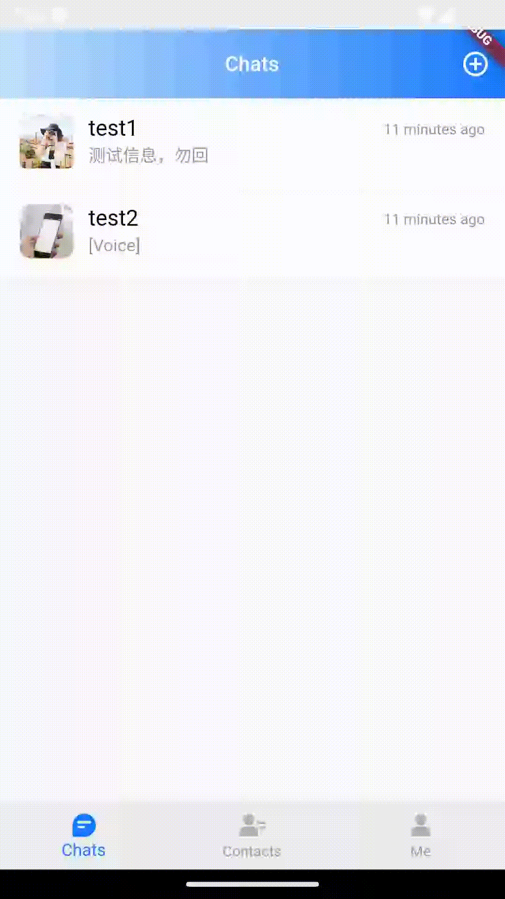
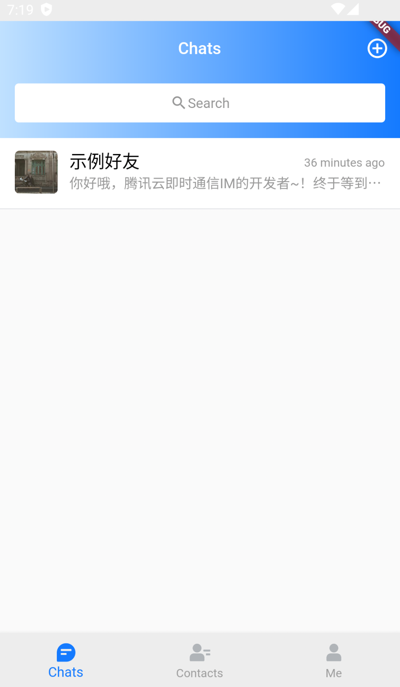
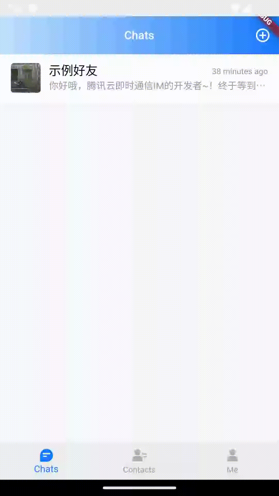
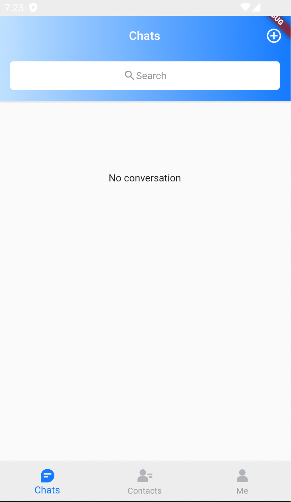
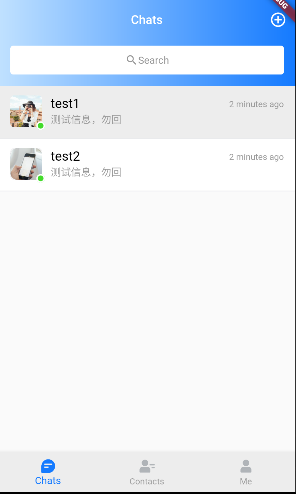
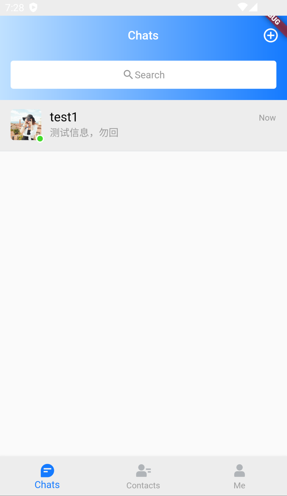
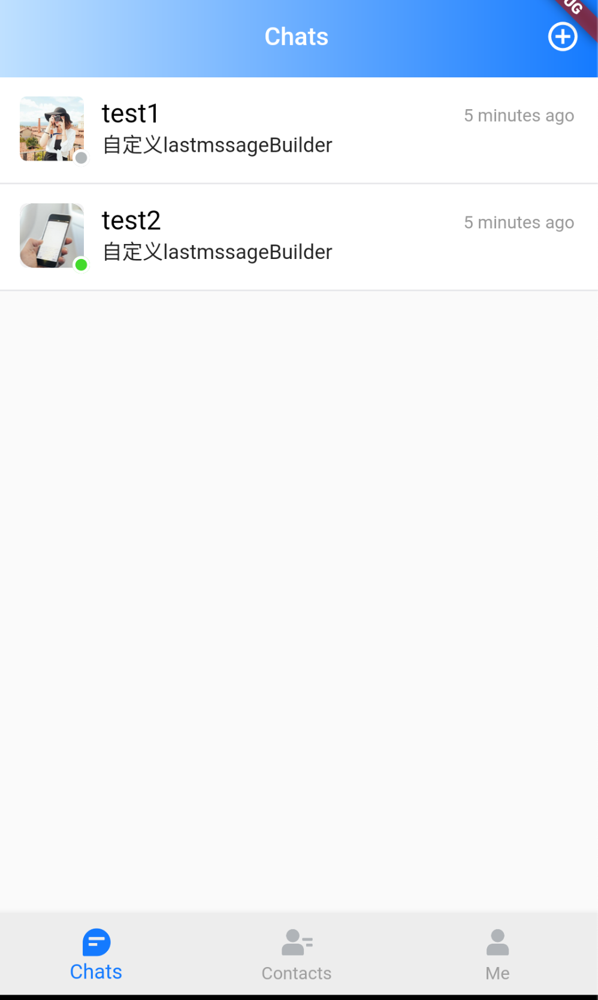
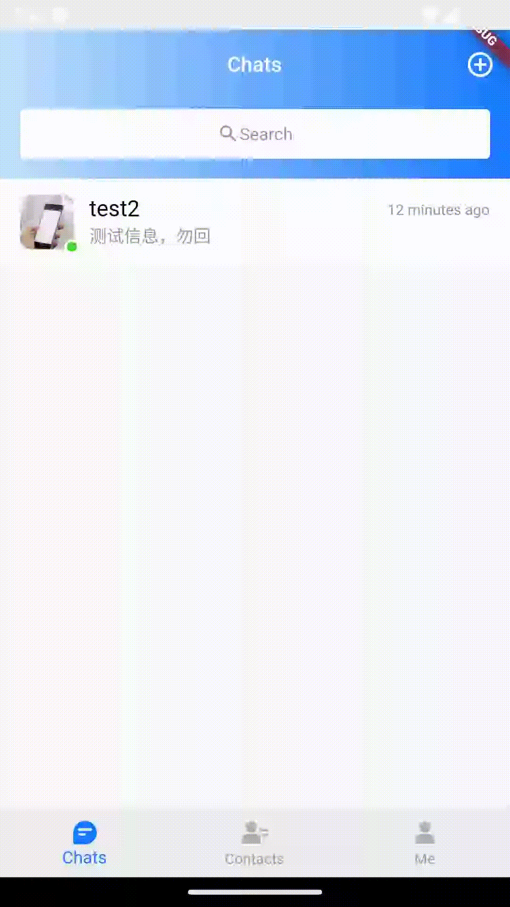
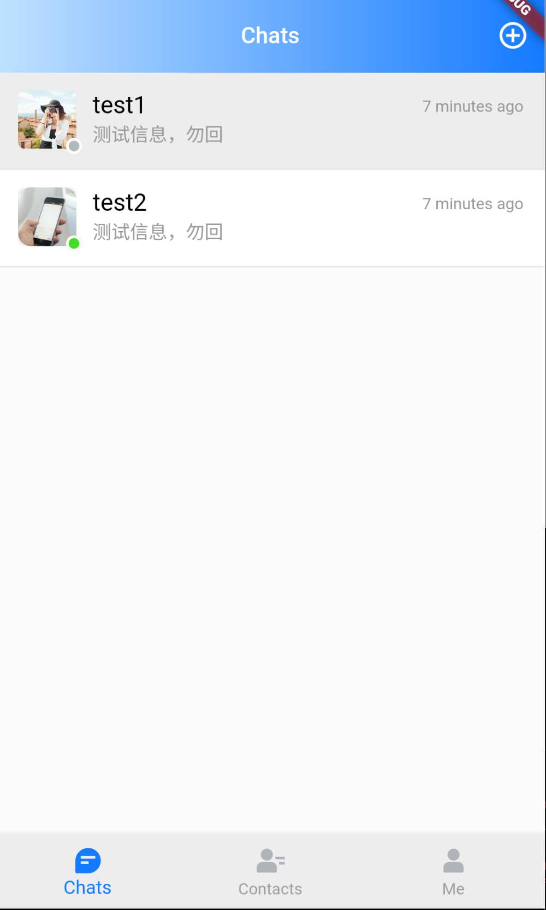

# TIMUIKitConversation

## 组件介绍及使用场景 <a href="#he-shi-shi-yong" id="he-shi-shi-yong"></a>

组件介绍：会话列表组件。

使用场景：展示会话列表时使用。

## 参数列表

| 参数                    | 说明                        | 类型                                                                                                                                                                                                | 是否必填 |
| --------------------- | ------------------------- | ------------------------------------------------------------------------------------------------------------------------------------------------------------------------------------------------- | ---- |
| onTapItem             | 会话模块点击触发的函数               | void Function< [V2TimConversation](../../api/guan-jian-lei/message/v2timconversation.md) >                                                                                                        | 否    |
| controller            | 关于会话列表操作的控制器(不可自定义)       | [TIMUIKitConversationController](TIMUIKitConversationController.md)                                                                                                                               |      |
| itemBuilder           | 用于自定义构建会话模块的构造器           | Widget Function( [V2TimConversation](../../api/guan-jian-lei/message/v2timconversation.md) conversationItem, \[[V2TimUserStatus](../../api/guan-jian-lei/user/v2timuserstatus.md)? onlineStatus]) | 否    |
| itemSlidableBuilder   | 用于自定义构建会话模块中的边缘滑动操作模块的构造器 | List< ConversationItemSlidablePanel > Function([V2TimConversation](../../api/guan-jian-lei/message/v2timconversation.md) conversationItem)                                                        | 否    |
| emptyBuilder          | 无会话时的样式构造器                | Widget Function()                                                                                                                                                                                 | 否    |
| conversationCollector | 会话列表展示的过滤器                | bool Function([V2TimConversation](../../api/guan-jian-lei/message/v2timconversation.md)? conversation)                                                                                            | 否    |
| lastMessageBuilder    | 当前会话最后一条消息的样式构造器          | Widget Function( [V2TimMessage](../../api/guan-jian-lei/message/v2timmessage.md)? lastMsg, List< [V2TimGroupAtInfo](../../api/guan-jian-lei/group/v2timgroupatinfo.md)? > groupAtInfoList)        | 否    |
| lifeCycle             | 聊天列表操作时的钩子函数              | [ConversationLifeCycle](ConversationLifeCycle.md)                                                                                                                                                 | 否    |
| isShowOnlineStatus    | 会话列表是否展示用户在线状态            | bool                                                                                                                                                                                              | 否    |

## 代码示例与效果展示

### onTapItem

onTapItem为会话模块点击触发的函数。

* 代码示例为使用自定义onTapItem做到点击跳转到此会话聊天页面。

#### 代码示例

```dart
  @override
  Widget build(BuildContext context) {
    void _handleOnConvItemTaped(V2TimConversation? selectedConv) async {
      await Navigator.push(
          context,
          MaterialPageRoute(
            builder: (context) => Chat(
              selectedConversation: selectedConv!,
            ),
          ));
      _controller.reloadData();
    }

    return Column(
      children: [
        Expanded(
          child: TIMUIKitConversation(
            isShowOnlineStatus: false,
            onTapItem: _handleOnConvItemTaped,
          ),
        )
      ],
    );
  }
```

#### 效果展示



### itemBuilder

itemBuilder为用于自定义构建会话模块的构造器

* 代码示例为使用自定义itemBuilder展示会话列表信息

#### 代码示例

```dart
  @override
  Widget build(BuildContext context) {
    final theme = Provider.of<DefaultThemeData>(context).theme;
    final TUIThemeViewModel themeViewModel =
        serviceLocator<TUIThemeViewModel>();
    void _handleOnConvItemTaped(V2TimConversation? selectedConv) async {
      await Navigator.push(
          context,
          MaterialPageRoute(
            builder: (context) => Chat(
              selectedConversation: selectedConv!,
            ),
          ));
      _controller.reloadData();
    }

    Widget _itemBuilder(V2TimConversation conversationItem,
        [V2TimUserStatus? onlineStatus]) {
      return InkWell(
        child: TIMUIKitConversationItem(
            faceUrl: conversationItem.faceUrl ?? "",
            nickName: conversationItem.showName ?? "",
            isDisturb: conversationItem.recvOpt != 0,
            lastMsg: conversationItem.lastMessage,
            isPined: conversationItem.isPinned ?? false,
            groupAtInfoList: conversationItem.groupAtInfoList ?? [],
            unreadCount: conversationItem.unreadCount ?? 0,
            draftText: conversationItem.draftText,
            onlineStatus: (true &&
                    conversationItem.userID != null &&
                    conversationItem.userID!.isNotEmpty)
                ? onlineStatus
                : null,
            draftTimestamp: conversationItem.draftTimestamp,
            convType: conversationItem.type),
        onTap: () => _handleOnConvItemTaped(conversationItem),
      );
    }

    return Column(
      children: [
        searchEntry(theme),
        Expanded(
          child: TIMUIKitConversation(
            controller: _controller,
            itembuilder: _itemBuilder,
            emptyBuilder: () {
              return Container(
                padding: const EdgeInsets.only(top: 100),
                child: Center(
                  child: Text(imt("暂无会话")),
                ),
              );
            },
          ),
        )
      ],
    );
  }
```

#### 效果展示



### itemSlidableBuilder

itemSlidableBuilder为用于自定义构建会话模块中的边缘滑动操作模块的构造器.

* 代码示例为使用itemSlidableBuilder构造边缘滑动操作模块的案例。

#### 代码示例

```dart
  @override
  Widget build(BuildContext context) {
    final TUIThemeViewModel themeViewModel =
        serviceLocator<TUIThemeViewModel>();
    List<ConversationItemSlidablePanel> _defaultSlidableBuilder(
      V2TimConversation conversationItem,
    ) {
      final theme = themeViewModel.theme;
      return [
        ConversationItemSlidablePanel(
          onPressed: (context) {
            _clearHistory(conversationItem);
          },
          backgroundColor: theme.primaryColor ?? CommonColor.primaryColor,
          foregroundColor: Colors.white,
          label: TIM_t("清除聊天"),
          spacing: 0,
          autoClose: true,
        ),
        ConversationItemSlidablePanel(
          onPressed: (context) {
            _pinConversation(conversationItem);
          },
          backgroundColor: theme.infoColor ?? CommonColor.infoColor,
          foregroundColor: Colors.white,
          label: conversationItem.isPinned! ? TIM_t("取消置顶") : TIM_t("置顶"),
        ),
        ConversationItemSlidablePanel(
          onPressed: (context) {
            _deleteConversation(conversationItem);
          },
          backgroundColor: Colors.red,
          foregroundColor: Colors.white,
          label: TIM_t("删除"),
        )
      ];
    }

    return Column(
      children: [
        Expanded(
          child: TIMUIKitConversation(
            itemSlidableBuilder: _itemSlidableBuilder,
            controller: _controller,
          ),
        )
      ],
    );
  }
```

#### 效果展示



### emptyBuilder

emptyBuilder决定了当会话列表为空时会话列表页面的样式。

* 代码示例为使用自定义emptyBuilder展示暂无会话的页面样式。

#### 代码示例

```dart
  @override
  Widget build(BuildContext context) {
    return Column(
      children: [
        Expanded(
          child: TIMUIKitConversation(
            emptyBuilder: () {
              return Container(
                padding: const EdgeInsets.only(top: 100),
                child: Center(
                  child: Text(imt("暂无会话")),
                ),
              );
            },
          ),
        )
      ],
    );
  }
```

#### 效果展示



### conversationCollector

conversationCollector为会话列表展示的过滤器

* 代码示例为使用conversationCollector做到不展示未置顶会话的案例。

#### 代码示例

```dart
  @override
  Widget build(BuildContext context) {
    final theme = Provider.of<DefaultThemeData>(context).theme;
    final LocalSetting localSetting = Provider.of<LocalSetting>(context);
    return Column(
      children: [
        searchEntry(theme),
        Expanded(
          child: TIMUIKitConversation(
            onTapItem: _handleOnConvItemTaped,
            isShowOnlineStatus: localSetting.isShowOnlineStatus,
            controller: _controller,
            conversationCollector: (conversation) {
              final isPinned = conversation?.isPinned ?? false;
              return isPinned;
            },
            emptyBuilder: () {
              return Container(
                padding: const EdgeInsets.only(top: 100),
                child: Center(
                  child: Text(imt("暂无会话")),
                ),
              );
            },
          ),
        )
      ],
    );
  }
```

#### 效果展示

 

### lastMessageBuilder

lastMessageBuilder为当前会话最后一条消息的样式构造器

* 代码示例为使用lastMessageBuilder做到在会话模块中展示当前会话最后一条消息的案例。

#### 代码示例

```dart
  @override
  Widget build(BuildContext context) {
    Widget _lastMessageBuilder(
        V2TimMessage? lastMsg, List<V2TimGroupAtInfo?> groupAtInfoList) {
      return const Text('自定义lastmssageBuilder');
    }

    return Column(
      children: [
        Expanded(
          child: TIMUIKitConversation(
            lastMessageBuilder: _lastMessageBuilder,
          ),
        )
      ],
    );
  }
```

#### 效果展示



### lifeCycle

lifeCycle为聊天列表操作时的钩子函数

* 代码示例为使用shouldDeleteConversation做到在删除会话前弹出弹窗的案例。

#### 代码示例

```dart
  @override
  Widget build(BuildContext context) {
    final theme = Provider.of<DefaultThemeData>(context).theme;
    final LocalSetting localSetting = Provider.of<LocalSetting>(context);
    ConversationLifeCycle lifeCycle = ConversationLifeCycle(
      shouldDeleteConversation: (String conversationID) async {
        // 删除会话前的逻辑
        // 弹出对话框
        Future<bool?> shouldDeleteConversationDialog() {
          return showDialog<bool>(
            context: context,
            builder: (context) {
              return AlertDialog(
                title: const Text("提示"),
                content: const Text("您确定要将此会话删除吗?"),
                actions: <Widget>[
                  TextButton(
                    child: const Text("取消"),
                    onPressed: () => Navigator.of(context).pop(), // 关闭对话框
                  ),
                  TextButton(
                    child: const Text("确定"),
                    onPressed: () {
                      //关闭对话框并返回true
                      Navigator.of(context).pop(true);
                    },
                  ),
                ],
              );
            },
          );
        }

        bool? isDelete = await shouldDeleteConversationDialog();
        return isDelete ?? false;
      },
    );
    return Column(
      children: [
        searchEntry(theme),
        Expanded(
          child: TIMUIKitConversation(
            lifeCycle: lifeCycle,
          ),
        )
      ],
    );
  }
```

#### 效果展示



### isShowOnlineStatus

isShowOnlineStatus为在会话列表中好友头像处是否展示好友在线状态的设置

* 代码示例为使用isShowOnlineStatus做到在会话列表中展示好友在线状态。

#### 代码示例

```dart
  @override
  Widget build(BuildContext context) {
    return Column(
      children: [
        Expanded(
          child: TIMUIKitConversation(
            isShowOnlineStatus: true,
          ),
        )
      ],
    );
  }
```

#### 效果展示



<style>
  img{
    width:220px;
    height:400px;
  }
</style>