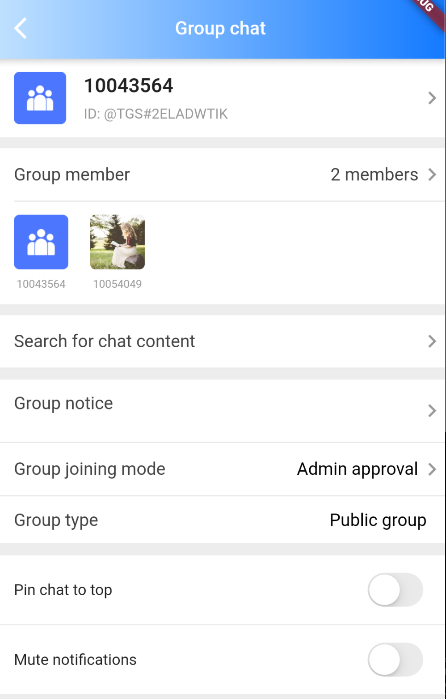
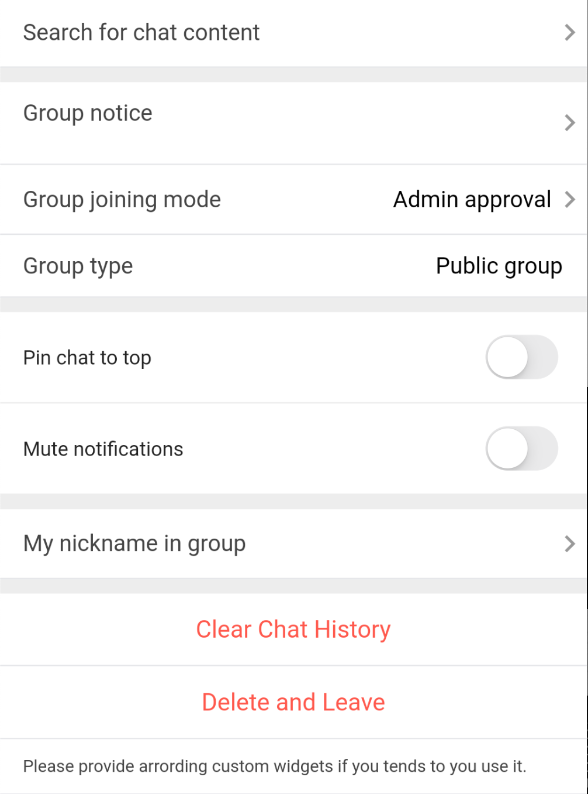
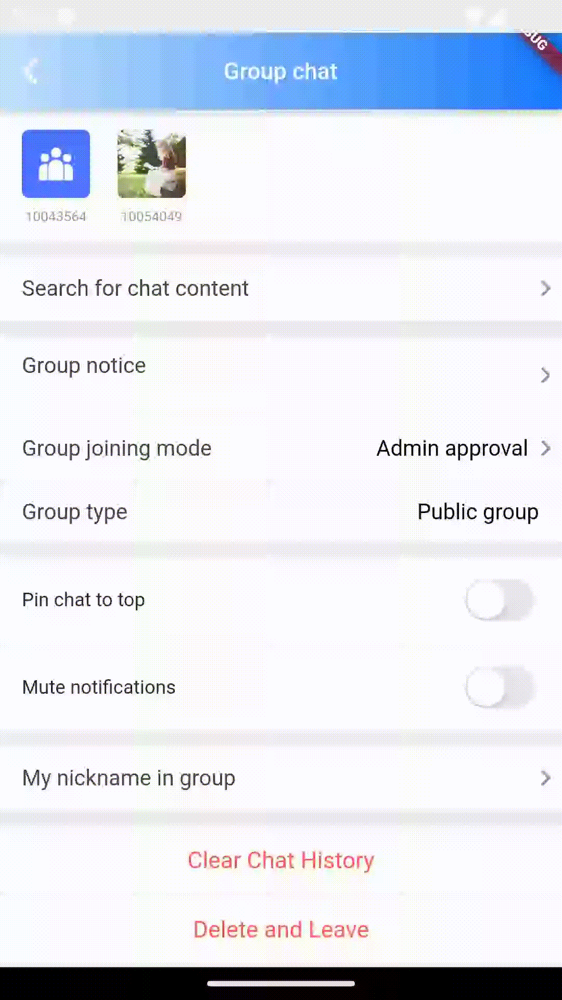

# TIMUIKitGroupProfile

## 组件介绍及使用场景 <a href="#he-shi-shi-yong" id="he-shi-shi-yong"></a>

组件介绍：群组信息组件

使用场景：展示群组信息时使用。

## 参数列表

| 参数                   | 说明                                                                      | 类型                                                          | 是否必填 |
| -------------------- | ----------------------------------------------------------------------- | ----------------------------------------------------------- | ---- |
| groupID              | 需要展示群组信息的群组id                                                           | String                                                      | 是    |
| backGroundColor      | 群组信息页面背景颜色                                                              | Color                                                       | 否    |
| profileWidgetBuilder | 用于自定义构建群组信息页面不同部分的构造器                                                   | [GroupProfileWidgetBuilder](GroupProfileWidgetBuilder.md)   | 否    |
| profileWidgetsOrder  | 用于自定义构建群组信息页面不同部分的排序设置                                                  | List< [GroupProfileWidgetEnum](GroupProfileWidgetEnum.md) > | 否    |
| builder              | 用于自定义构建整个用群组信息页面的构造器（若使用此属性则profileWidgetBuilder与profileWidgetsOrder失效） | [GroupProfileBuilder](GroupProfileBuilder.md)               | 否    |
| lifeCycle            | 群组信息操作时的钩子函数                                                            | [GroupProfileLifeCycle](GroupProfileLifeCycle.md)           | 否    |

## 代码示例与效果展示

### profileWidgetBuilder与profileWidgetsOrder

profileWidgetsOrder决定了profileWidgetBuilder中组件在页面的排列顺序。

* 例如，当profileWidgetsOrder为\[GroupProfileWidgetEnum.detailCard,GroupProfileWidgetEnum.memberListTile]时，detailCard组件会在memberListTile组件的上方。

profileWidgetBuilder决定了在TIMUIKitGroupProfile中不同名称的组件的渲染结果。

* profileWidgetBuilder中除了searchBar与customBuilder(One-Five)，其余均有默认组件。
* 代码示例为自定义searchBar与customBuilderOne的示例，如用户需要自定义其余组件，在传入TIMUIKitGroupProfile的profileWidgetBuilder属性中添加[组件名](GroupProfileWidgetBuilder.md)即可。

#### 代码示例

```dart
  @override
  Widget build(BuildContext context) {
    final List<GroupProfileWidgetEnum> widgetOrder = [
      GroupProfileWidgetEnum.detailCard, //群组详细信息
      GroupProfileWidgetEnum.operationDivider, //分割线
      GroupProfileWidgetEnum.memberListTile, //群组成员列表
      GroupProfileWidgetEnum.operationDivider, //分割线
      GroupProfileWidgetEnum.searchMessage, //查找聊天内容
      GroupProfileWidgetEnum.operationDivider, //分割线
      GroupProfileWidgetEnum.groupNotice, //群公告
      GroupProfileWidgetEnum.groupManage, //群管理
      GroupProfileWidgetEnum.groupJoiningModeBar, //加群方式设置
      GroupProfileWidgetEnum.groupTypeBar, //群类型栏
      GroupProfileWidgetEnum.operationDivider, //分割线
      GroupProfileWidgetEnum.pinedConversationBar, //置顶聊天功能
      GroupProfileWidgetEnum.muteGroupMessageBar, //消息免打扰
      GroupProfileWidgetEnum.operationDivider, //分割线
      GroupProfileWidgetEnum.nameCardBar, //我的群昵称
      GroupProfileWidgetEnum.operationDivider, //分割线
      GroupProfileWidgetEnum.buttonArea, //按钮功能区
      GroupProfileWidgetEnum.customBuilderOne //自定义区域一
    ];
    final theme = Provider.of<DefaultThemeData>(context).theme;
    return Scaffold(
        appBar: AppBar(
            title: Text(
              imt("群聊"),
              style: const TextStyle(color: Colors.white, fontSize: 17),
            ),
            shadowColor: Colors.white,
            flexibleSpace: Container(
              decoration: BoxDecoration(
                gradient: LinearGradient(colors: [
                  theme.lightPrimaryColor ?? CommonColor.lightPrimaryColor,
                  theme.primaryColor ?? CommonColor.primaryColor
                ]),
              ),
            ),
            iconTheme: const IconThemeData(
              color: Colors.white,
            )),
        body: SafeArea(
          child: TIMUIKitGroupProfile(
            profileWidgetsOrder: widgetOrder,
            lifeCycle: GroupProfileLifeCycle(didLeaveGroup: () async {
              Navigator.pushAndRemoveUntil(
                  context,
                  MaterialPageRoute(
                      builder: (context) => const HomePage(
                            pageIndex: 1,
                          )),
                  (route) => false);
            }),
            groupID: groupID,
            profileWidgetBuilder: GroupProfileWidgetBuilder(
              searchMessage: () {
                return TIMUIKitGroupProfileWidget.searchMessage(
                    (V2TimConversation? conversation) {
                  Navigator.push(
                      context,
                      MaterialPageRoute(
                          builder: (context) => Search(
                                onTapConversation:
                                    (V2TimConversation conversation,
                                        V2TimMessage? targetMsg) {
                                  Navigator.push(
                                      context,
                                      MaterialPageRoute(
                                        builder: (context) => Chat(
                                          selectedConversation: conversation,
                                          initFindingMsg: targetMsg,
                                        ),
                                      ));
                                },
                                conversation: conversation,
                              )));
                });
              },
              customBuilderOne: (groupInfo, groupMemberList) {
                return Container(
                  padding:
                      const EdgeInsets.symmetric(vertical: 12, horizontal: 16),
                  decoration: BoxDecoration(
                      color: Colors.white,
                      border: Border(
                          bottom: BorderSide(
                              color: theme.weakDividerColor ??
                                  CommonColor.weakDividerColor))),
                  child: Row(
                    mainAxisAlignment: MainAxisAlignment.spaceBetween,
                    children: [
                      Text(
                        TIM_t("如使用自定义区域，请在profileWidgetBuilder传入对应组件"),
                        style:
                            TextStyle(fontSize: 12, color: theme.darkTextColor),
                      ),
                    ],
                  ),
                );
              },
            ),
          ),
        ));
  }
```

#### 效果展示

 

### builder

builder为用于自定义构建整个用户信息页面的构造器

* 若使用此属性则profileWidgetBuilder与profileWidgetsOrder失效
* 代码示例为使用自定义builder只展示群组信息卡片、群组成员信息的案例

#### 代码示例

```dart
  @override
  Widget build(BuildContext context) {
    final theme = Provider.of<DefaultThemeData>(context).theme;
    return Scaffold(
        appBar: AppBar(
            title: Text(
              imt("群聊"),
              style: const TextStyle(color: Colors.white, fontSize: 17),
            ),
            shadowColor: Colors.white,
            flexibleSpace: Container(
              decoration: BoxDecoration(
                gradient: LinearGradient(colors: [
                  theme.lightPrimaryColor ?? CommonColor.lightPrimaryColor,
                  theme.primaryColor ?? CommonColor.primaryColor
                ]),
              ),
            ),
            iconTheme: const IconThemeData(
              color: Colors.white,
            )),
        body: SafeArea(
          child: TIMUIKitGroupProfile(
            lifeCycle: GroupProfileLifeCycle(didLeaveGroup: () async {
              Navigator.pushAndRemoveUntil(
                  context,
                  MaterialPageRoute(
                      builder: (context) => const HomePage(
                            pageIndex: 1,
                          )),
                  (route) => false);
            }),
            groupID: groupID,
            builder: (context, groupInfo, groupMemberList) {
              return Column(
                children: [
                  TIMUIKitGroupProfileWidget.detailCard(groupInfo: groupInfo),
                  TIMUIKitGroupProfileWidget.operationDivider(),
                  TIMUIKitGroupProfileWidget.memberTile()
                ],
              );
            },
          ),
        ));
  }
```

#### 效果展示


### lifeCycle

lifeCycle为群组信息操作时的钩子函数

* 代码示例为使用didLeaveGroup做到退出群组后回到联系人页面的案例。

#### 代码示例

```dart
  @override
  Widget build(BuildContext context) {
    final theme = Provider.of<DefaultThemeData>(context).theme;
    return Scaffold(
        appBar: AppBar(
            title: Text(
              imt("群聊"),
              style: const TextStyle(color: Colors.white, fontSize: 17),
            ),
            shadowColor: Colors.white,
            flexibleSpace: Container(
              decoration: BoxDecoration(
                gradient: LinearGradient(colors: [
                  theme.lightPrimaryColor ?? CommonColor.lightPrimaryColor,
                  theme.primaryColor ?? CommonColor.primaryColor
                ]),
              ),
            ),
            iconTheme: const IconThemeData(
              color: Colors.white,
            )),
        body: SafeArea(
          child: TIMUIKitGroupProfile(
            lifeCycle: GroupProfileLifeCycle(didLeaveGroup: () async {
              Navigator.pushAndRemoveUntil(
                  context,
                  MaterialPageRoute(
                      builder: (context) => const HomePage(
                            pageIndex: 1,
                          )),
                  (route) => false);
            }),
            groupID: groupID,
            profileWidgetBuilder: GroupProfileWidgetBuilder(searchMessage: () {
              return TIMUIKitGroupProfileWidget.searchMessage(
                  (V2TimConversation? conversation) {
                Navigator.push(
                    context,
                    MaterialPageRoute(
                        builder: (context) => Search(
                              onTapConversation:
                                  (V2TimConversation conversation,
                                      V2TimMessage? targetMsg) {
                                Navigator.push(
                                    context,
                                    MaterialPageRoute(
                                      builder: (context) => Chat(
                                        selectedConversation: conversation,
                                        initFindingMsg: targetMsg,
                                      ),
                                    ));
                              },
                              conversation: conversation,
                            )));
              });
            }),
          ),
        ));
  }
```

#### 效果展示



img{ width:220px; height:400px; }
