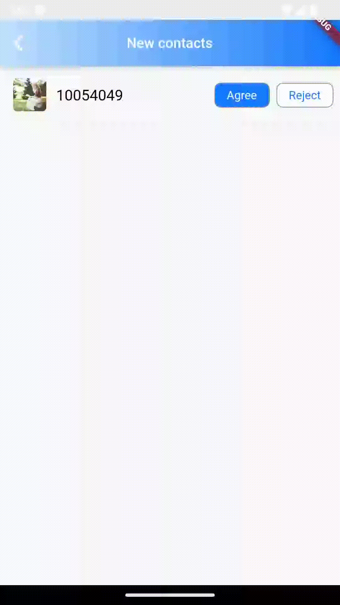
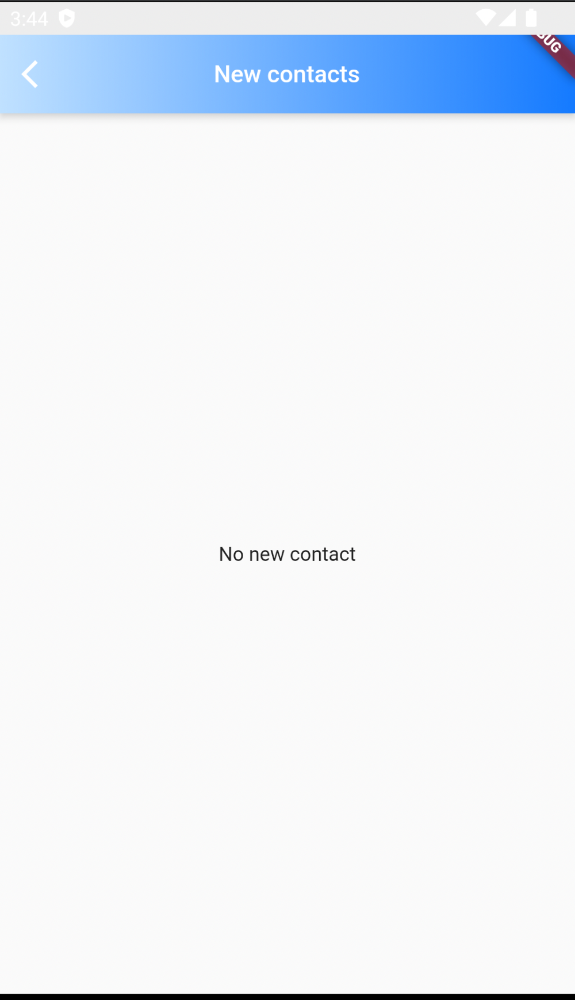
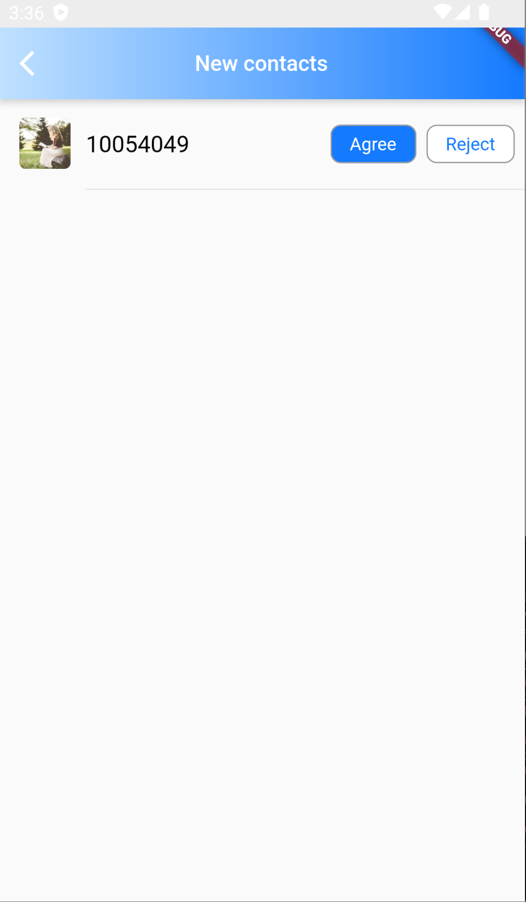

# TIMUIKitNewContact

## 组件介绍及使用场景 <a href="#he-shi-shi-yong" id="he-shi-shi-yong"></a>

组件介绍：新的联系人列表组件。

使用场景：同意或拒绝新的好友请求时使用的页面。

## 参数列表

| 参数           | 说明                | 类型                                                                             | 是否必填 |
| ------------ | ----------------- | ------------------------------------------------------------------------------ | ---- |
| onAccept     | 在用户接受好友请求后的回调函数   | void Function(V2TimFriendApplication applicationInfo)                          | 否    |
| onRefuse     | 在用户拒绝好友请求后的回调函数   | void Function(V2TimFriendApplication applicationInfo)                          | 否    |
| emptyBuilder | 无好友请求时的样式构造器      | Widget Function(BuildContext context)                                          | 否    |
| itemBuilder  | 用于自定义构建好友请求的样式构造器 | Widget Function( BuildContext context, V2TimFriendApplication applicationInfo) | 否    |
| lifeCycle    | 对新的联系人操作时的钩子函数    | [NewContactLifeCycle](NewContactLifeCycle.md)                                  | 否    |

## 代码示例与效果展示

### onAccept与onRefuse

onAccept与onRefuse为在用户接受或拒绝好友请求**后**的回调函数

* 代码示例为使用onAccept做到当用户同意好友申请后出现提示框

#### 代码示例

```dart
  @override
  Widget build(BuildContext context) {
    final theme = Provider.of<DefaultThemeData>(context).theme;
    return Scaffold(
      appBar: AppBar(
          title: Text(
            imt("新的联系人"),
            style: const TextStyle(color: Colors.white, fontSize: 17),
          ),
          shadowColor: Colors.white,
          flexibleSpace: Container(
            decoration: BoxDecoration(
              gradient: LinearGradient(colors: [
                theme.lightPrimaryColor ?? CommonColor.lightPrimaryColor,
                theme.primaryColor ?? CommonColor.primaryColor
              ]),
            ),
          ),
          iconTheme: const IconThemeData(
            color: Colors.white,
          )),
      body: TIMUIKitNewContact(
        onAccept: (V2TimFriendApplication applicationInfo) {
          Utils.toast('你已经添加${applicationInfo.userID}为好友');
        },
        emptyBuilder: (c) {
          return Center(
            child: Text(imt("暂无新联系人")),
          );
        },
      ),
    );
  }
```

#### 效果展示



### emptyBuilder

emptyBuilder决定了当新的联系人列表为空时黑名单列表页面的样式。

* 代码示例为使用自定义emptyBuilder展示暂无新的联系人的页面样式。

```dart
  @override
  Widget build(BuildContext context) {
    final theme = Provider.of<DefaultThemeData>(context).theme;
    return Scaffold(
      appBar: AppBar(
          title: Text(
            imt("新的联系人"),
            style: const TextStyle(color: Colors.white, fontSize: 17),
          ),
          shadowColor: Colors.white,
          flexibleSpace: Container(
            decoration: BoxDecoration(
              gradient: LinearGradient(colors: [
                theme.lightPrimaryColor ?? CommonColor.lightPrimaryColor,
                theme.primaryColor ?? CommonColor.primaryColor
              ]),
            ),
          ),
          iconTheme: const IconThemeData(
            color: Colors.white,
          )),
      body: TIMUIKitNewContact(
        emptyBuilder: (c) {
          return Center(
            child: Text(imt("暂无新联系人")),
          );
        },
      ),
    );
  }
```

#### 效果展示



### itemBuilder

itemBuilder为用于自定义构建新的联系人用户模块的构造器

* 代码示例为使用自定义itemBuilder展示新的联系人用户信息

```dart
  @override
  Widget build(BuildContext context) {
    final theme = Provider.of<DefaultThemeData>(context).theme;
    late TUIFriendShipViewModel model =
        serviceLocator<TUIFriendShipViewModel>();
    _getShowName(V2TimFriendApplication item) {
      final nickName = item.nickname ?? "";
      final userID = item.userID;
      return nickName != "" ? nickName : userID;
    }

    Widget _itemBuilder(
        BuildContext context, V2TimFriendApplication applicationInfo) {
      final theme = Provider.of<TUIThemeViewModel>(context).theme;
      final showName = _getShowName(applicationInfo);
      final faceUrl = applicationInfo.faceUrl ?? "";
      return Container(
        padding: const EdgeInsets.only(top: 10, left: 16),
        child: Row(
          children: [
            Container(
              padding: const EdgeInsets.only(bottom: 12),
              margin: const EdgeInsets.only(right: 12),
              child: SizedBox(
                height: 40,
                width: 40,
                child: Avatar(faceUrl: faceUrl, showName: showName),
              ),
            ),
            Expanded(
                child: Container(
              padding: const EdgeInsets.only(top: 10, bottom: 20),
              decoration: BoxDecoration(
                  border: Border(
                      bottom: BorderSide(
                          color: theme.weakDividerColor ??
                              CommonColor.weakDividerColor))),
              child: Row(
                mainAxisAlignment: MainAxisAlignment.spaceBetween,
                children: [
                  Text(
                    showName,
                    style: const TextStyle(color: Colors.black, fontSize: 18),
                  ),
                  Expanded(child: Container()),
                  Container(
                    margin: const EdgeInsets.only(right: 8),
                    child: InkWell(
                      child: Container(
                        padding: const EdgeInsets.symmetric(
                            horizontal: 14, vertical: 6),
                        decoration: BoxDecoration(
                            borderRadius: BorderRadius.circular(8),
                            color: theme.primaryColor,
                            border: Border.all(
                                width: 1,
                                color: theme.weakTextColor ??
                                    CommonColor.weakTextColor)),
                        child: Text(
                          TIM_t("同意"),
                          style: const TextStyle(
                            color: Colors.white,
                          ),
                        ),
                      ),
                      onTap: () async {
                        await model.acceptFriendApplication(
                          applicationInfo.userID,
                          applicationInfo.type,
                        );
                        model.loadData();
                      },
                    ),
                  ),
                  Container(
                      margin: const EdgeInsets.only(right: 8),
                      child: InkWell(
                        child: Container(
                          decoration: BoxDecoration(
                              borderRadius: BorderRadius.circular(8),
                              color: Colors.white,
                              border: Border.all(
                                  width: 1,
                                  color: theme.weakTextColor ??
                                      CommonColor.weakTextColor)),
                          padding: const EdgeInsets.symmetric(
                              horizontal: 14, vertical: 6),
                          child: Text(
                            TIM_t("拒绝"),
                            style: TextStyle(
                              color: theme.primaryColor,
                            ),
                          ),
                        ),
                        onTap: () async {
                          await model.refuseFriendApplication(
                            applicationInfo.userID,
                            applicationInfo.type,
                          );
                          model.loadData();
                        },
                      ))
                ],
              ),
            ))
          ],
        ),
      );
    }

    return Scaffold(
      appBar: AppBar(
          title: Text(
            imt("新的联系人"),
            style: const TextStyle(color: Colors.white, fontSize: 17),
          ),
          shadowColor: Colors.white,
          flexibleSpace: Container(
            decoration: BoxDecoration(
              gradient: LinearGradient(colors: [
                theme.lightPrimaryColor ?? CommonColor.lightPrimaryColor,
                theme.primaryColor ?? CommonColor.primaryColor
              ]),
            ),
          ),
          iconTheme: const IconThemeData(
            color: Colors.white,
          )),
      body: TIMUIKitNewContact(
        itemBuilder: _itemBuilder,
        emptyBuilder: (c) {
          return Center(
            child: Text(imt("暂无新联系人")),
          );
        },
      ),
    );
  }
```

#### 效果展示



### lifeCycle

lifeCycle为添加群组操作时的钩子函数

* 代码示例为使用shouldAcceptContactApplication做到接受好友申请前跳出弹窗的案例。

#### 代码示例

```dart
  @override
  Widget build(BuildContext context) {
    final theme = Provider.of<DefaultThemeData>(context).theme;
    NewContactLifeCycle lifeCycle = NewContactLifeCycle(
      shouldAcceptContactApplication: (String userID) async {
        // 接受好友申请前的逻辑
        // 弹出对话框
        Future<bool?> shouldAcceptContactApplicationDialog() {
          return showDialog<bool>(
            context: context,
            builder: (context) {
              return AlertDialog(
                title: const Text("提示"),
                content: const Text("您确定要接受此用户的好友申请吗?"),
                actions: <Widget>[
                  TextButton(
                    child: const Text("取消"),
                    onPressed: () => Navigator.of(context).pop(), // 关闭对话框
                  ),
                  TextButton(
                    child: const Text("确定"),
                    onPressed: () {
                      //关闭对话框并返回true
                      Navigator.of(context).pop(true);
                    },
                  ),
                ],
              );
            },
          );
        }

        bool? isAccept = await shouldAcceptContactApplicationDialog();
        return isAccept ?? false;
      },
      shouldRefuseContactApplication: (String userID) async {
        // 拒绝好友申请前的逻辑
        return true;
      },
    );
    return Scaffold(
      appBar: AppBar(
          title: Text(
            imt("新的联系人"),
            style: const TextStyle(color: Colors.white, fontSize: 17),
          ),
          shadowColor: Colors.white,
          flexibleSpace: Container(
            decoration: BoxDecoration(
              gradient: LinearGradient(colors: [
                theme.lightPrimaryColor ?? CommonColor.lightPrimaryColor,
                theme.primaryColor ?? CommonColor.primaryColor
              ]),
            ),
          ),
          iconTheme: const IconThemeData(
            color: Colors.white,
          )),
      body: TIMUIKitNewContact(
        lifeCycle: lifeCycle,
        emptyBuilder: (c) {
          return Center(
            child: Text(imt("暂无新联系人")),
          );
        },
      ),
    );
  }
```

#### 效果展示


img{ width:220px; height:400px; }
