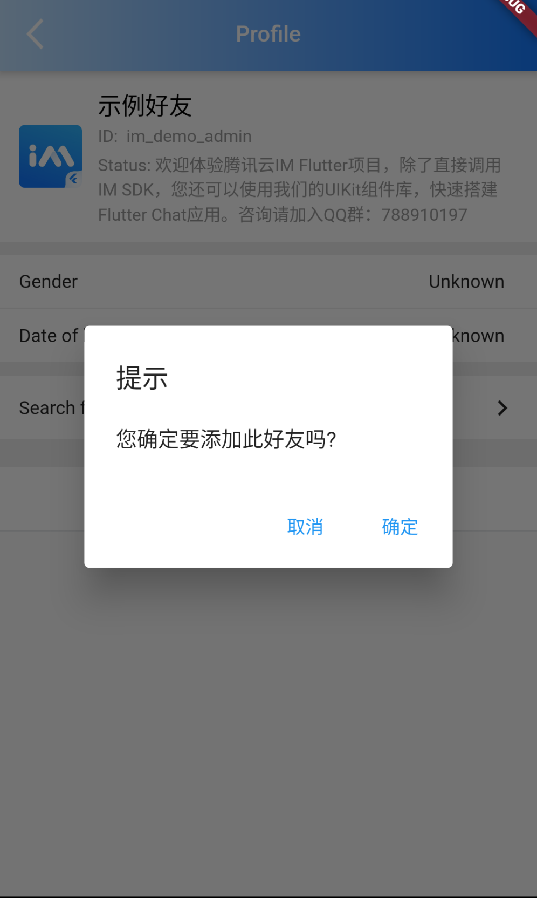

# TIMUIKitProfile

## 组件介绍及使用场景 <a href="#he-shi-shi-yong" id="he-shi-shi-yong"></a>

组件介绍：用户信息组件。

使用场景：展示用户信息时使用。

## 参数列表

| 参数                   | 说明                                                                     | 类型                                                        | 是否必填 |
| -------------------- | ---------------------------------------------------------------------- | --------------------------------------------------------- | ---- |
| userID               | 需要展示用户信息的用户id                                                          | String                                                    | 是    |
| controller           | 关于用户信息操作的控制器(不可自定义)                                                    | [TIMUIKitProfileController](TIMUIKitProfileController.md) | 否    |
| profileWidgetBuilder | 用于自定义构建用户信息页面不同部分的构造器                                                  | [ProfileWidgetBuilder](ProfileWidgetBuilder.md)           | 否    |
| profileWidgetsOrder  | 用于自定义构建用户信息页面不同部分的排序设置                                                 | List< [ProfileWidgetEnum](ProfileWidgetEnum.md) >         | 否    |
| builder              | 用于自定义构建整个用户信息页面的构造器（若使用此属性则profileWidgetBuilder与profileWidgetsOrder失效） | [ProfileBuilder](ProfileBuilder.md)                       | 否    |
| lifeCycle            | 用户信息操作时的钩子函数                                                           | [OnSelProfileLifeCycle](OnSelProfileLifeCycle.md)         | 否    |

## 代码示例与效果展示

### profileWidgetBuilder与profileWidgetsOrder

profileWidgetsOrder决定了profileWidgetBuilder中组件在页面的排列顺序。

* 例如，当profileWidgetsOrder为\[ProfileWidgetEnum.userInfoCard,ProfileWidgetEnum.portraitBar]时，userInfoCard组件会在portraitBar组件的上方。

profileWidgetBuilder决定了在TIMUIKitProfile中不同名称的组件的渲染结果。

* profileWidgetBuilder中除了searchBar与customBuilder(One-Five)，其余均有默认组件。
* 代码示例为自定义searchBar与customBuilderOne的示例，如用户需要自定义其余组件，在传入TIMUIKitProfile的profileWidgetBuilder属性中添加[组件名](ProfileWidgetBuilder.md)即可。

#### 代码示例

```dart
  _buildBottomOperationList(
      BuildContext context, V2TimConversation conversation, theme) {
    final operationList = [
      {
        "label": imt("发送消息"),
        "id": "sendMsg",
      },
      {
        "label": imt("语音通话"),
        "id": "audioCall",
      },
      {
        "label": imt("视频通话"),
        "id": "videoCall",
      },
    ];

    return operationList.map((e) {
      return InkWell(
        onTap: () {},
        child: Container(
          alignment: Alignment.center,
          padding: const EdgeInsets.symmetric(vertical: 15),
          decoration: BoxDecoration(
              color: Colors.white,
              border:
                  Border(bottom: BorderSide(color: theme.weakDividerColor))),
          child: Text(
            e["label"] ?? "",
            style: TextStyle(
                color: e["id"] != "deleteFriend"
                    ? theme.primaryColor
                    : theme.cautionColor,
                fontSize: 17),
          ),
        ),
      );
    }).toList();
  }
  @override
  Widget build(BuildContext context) {
    final theme = Provider.of<DefaultThemeData>(context).theme;
    return Scaffold(
      appBar: AppBar(
        shadowColor: Colors.white,
        title: Text(
          imt("详细资料"),
          style: const TextStyle(color: Colors.white, fontSize: 17),
        ),
        flexibleSpace: Container(
          decoration: BoxDecoration(
            gradient: LinearGradient(colors: [
              theme.lightPrimaryColor ?? CommonColor.lightPrimaryColor,
              theme.primaryColor ?? CommonColor.primaryColor
            ]),
          ),
        ),
        iconTheme: const IconThemeData(
          color: Colors.white,
        ),
        leading: IconButton(
          padding: const EdgeInsets.only(left: 16),
          icon: Image.asset(
            'images/arrow_back.png',
            package: 'tim_ui_kit',
            height: 34,
            width: 34,
          ),
          onPressed: () {
            Navigator.pop(context, newUserMARK);
          },
        ),
      ),
      body: Container(
        color: theme.weakBackgroundColor,
        child: TIMUIKitProfile(
          userID: widget.userID,
          profileWidgetBuilder: ProfileWidgetBuilder(
              searchBar: (conversation) => TIMUIKitProfileWidget.searchBar(
                      context, conversation, handleTap: () {
                    Navigator.push(
                        context,
                        MaterialPageRoute(
                          builder: (context) => Search(
                              conversation: conversation,
                              onTapConversation:
                                  (V2TimConversation conversation,
                                      [V2TimMessage? targetMsg]) {
                                Navigator.push(
                                    context,
                                    MaterialPageRoute(
                                      builder: (context) => Chat(
                                        selectedConversation: conversation,
                                        initFindingMsg: targetMsg,
                                      ),
                                    ));
                              }),
                        ));
                  }),
              customBuilderOne: (bool isFriend, V2TimFriendInfo friendInfo,
                  V2TimConversation conversation) {
                if (!isFriend) {
                  return Container();
                }
                return Column(
                    children: _buildBottomOperationList(
                        context, conversation, theme));
              }),
          controller: _timuiKitProfileController,
          profileWidgetsOrder: const [
            ProfileWidgetEnum.userInfoCard,//用户信息卡片
            ProfileWidgetEnum.portraitBar,//用户头像栏
            ProfileWidgetEnum.nicknameBar,//用户昵称栏
            ProfileWidgetEnum.userAccountBar,//用户账号栏
            ProfileWidgetEnum.signatureBar,//用户签名栏
            ProfileWidgetEnum.operationDivider,//分割线
            ProfileWidgetEnum.remarkBar,//用户备注
            ProfileWidgetEnum.genderBar,//用户性别
            ProfileWidgetEnum.birthdayBar,//用户生日
            ProfileWidgetEnum.operationDivider,//分割线
            ProfileWidgetEnum.searchBar,//搜索组件（自定义）
            ProfileWidgetEnum.operationDivider,//分割线
            ProfileWidgetEnum.addToBlockListBar,//添加黑名单功能
            ProfileWidgetEnum.pinConversationBar,//会话置顶功能
            ProfileWidgetEnum.messageMute,//禁言用户功能
            ProfileWidgetEnum.operationDivider,//分割线
            ProfileWidgetEnum.customBuilderOne,//自定义区域一（自定义）
            ProfileWidgetEnum.addAndDeleteArea//添加或删除功能
          ],
        ),
      ),
    );
  }
```

#### 效果展示

 

### builder

builder为用于自定义构建整个用户信息页面的构造器

* 若使用此属性则profileWidgetBuilder与profileWidgetsOrder失效
* 代码示例为使用自定义builder只展示用户信息卡片、用户性别、用户生日的案例

#### 代码示例

```dart
  @override
  Widget build(BuildContext context) {
    final theme = Provider.of<DefaultThemeData>(context).theme;
    return Scaffold(
      appBar: AppBar(
        shadowColor: Colors.white,
        title: Text(
          imt("详细资料"),
          style: const TextStyle(color: Colors.white, fontSize: 17),
        ),
        flexibleSpace: Container(
          decoration: BoxDecoration(
            gradient: LinearGradient(colors: [
              theme.lightPrimaryColor ?? CommonColor.lightPrimaryColor,
              theme.primaryColor ?? CommonColor.primaryColor
            ]),
          ),
        ),
        iconTheme: const IconThemeData(
          color: Colors.white,
        ),
        leading: IconButton(
          padding: const EdgeInsets.only(left: 16),
          icon: Image.asset(
            'images/arrow_back.png',
            package: 'tim_ui_kit',
            height: 34,
            width: 34,
          ),
          onPressed: () {
            Navigator.pop(context, newUserMARK);
          },
        ),
      ),
      body: Container(
        color: theme.weakBackgroundColor,
        child: TIMUIKitProfile(
          builder: (context, friendInfo, conversation, friendType, isMute) {
            return Column(
              children: [
                TIMUIKitProfileUserInfoCard(userInfo: friendInfo.userProfile),
                TIMUIKitProfileWidget.genderBar(
                    friendInfo.userProfile?.gender ?? 0),
                TIMUIKitProfileWidget.birthdayBar(
                    friendInfo.userProfile?.birthday)
              ],
            );
          },
          userID: widget.userID,
          controller: _timuiKitProfileController,
        ),
      ),
    );
  }
```

#### 效果展示


### lifeCycle

lifeCycle为用户信息操作时的钩子函数

* 代码示例为使用shouldAddFriend做到添加好友前跳出弹窗的案例。

#### 代码示例

```dart
  @override
  Widget build(BuildContext context) {
    final theme = Provider.of<DefaultThemeData>(context).theme;
    ProfileLifeCycle lifeCycle = ProfileLifeCycle(
      shouldAddToBlockList: (String userID) async {
        //用户被添加入黑名单前的逻辑
        return true;
      },
      shouldAddFriend: (String userID) async {
        //发送好友请求前的逻辑
        // 弹出对话框
        Future<bool?> showShouldAddToBlockListDialog() {
          return showDialog<bool>(
            context: context,
            builder: (context) {
              return AlertDialog(
                title: const Text("提示"),
                content: const Text("您确定要添加此好友吗?"),
                actions: <Widget>[
                  TextButton(
                    child: const Text("取消"),
                    onPressed: () => Navigator.of(context).pop(), // 关闭对话框
                  ),
                  TextButton(
                    child: const Text("确定"),
                    onPressed: () {
                      //关闭对话框并返回true
                      Navigator.of(context).pop(true);
                    },
                  ),
                ],
              );
            },
          );
        }

        bool? isAdd = await showShouldAddToBlockListDialog();
        return isAdd ?? false;
      },
      shouldDeleteFriend: (String userID) async {
        //删除好友前的逻辑
        return true;
      },
      didGetFriendInfo: (V2TimFriendInfo? friendInfo) async {
        //获取好友信息前的逻辑
        return friendInfo;
      },
    );
    return Scaffold(
      appBar: AppBar(
        shadowColor: Colors.white,
        title: Text(
          imt("详细资料"),
          style: const TextStyle(color: Colors.white, fontSize: 17),
        ),
        flexibleSpace: Container(
          decoration: BoxDecoration(
            gradient: LinearGradient(colors: [
              theme.lightPrimaryColor ?? CommonColor.lightPrimaryColor,
              theme.primaryColor ?? CommonColor.primaryColor
            ]),
          ),
        ),
        iconTheme: const IconThemeData(
          color: Colors.white,
        ),
        leading: IconButton(
          padding: const EdgeInsets.only(left: 16),
          icon: Image.asset(
            'images/arrow_back.png',
            package: 'tim_ui_kit',
            height: 34,
            width: 34,
          ),
          onPressed: () {
            Navigator.pop(context, newUserMARK);
          },
        ),
      ),
      body: Container(
        color: theme.weakBackgroundColor,
        child: TIMUIKitProfile(
          lifeCycle: lifeCycle,
          userID: widget.userID,
          profileWidgetBuilder: ProfileWidgetBuilder(
              searchBar: (conversation) => TIMUIKitProfileWidget.searchBar(
                      context, conversation, handleTap: () {
                    Navigator.push(
                        context,
                        MaterialPageRoute(
                          builder: (context) => Search(
                              conversation: conversation,
                              onTapConversation:
                                  (V2TimConversation conversation,
                                      [V2TimMessage? targetMsg]) {
                                Navigator.push(
                                    context,
                                    MaterialPageRoute(
                                      builder: (context) => Chat(
                                        selectedConversation: conversation,
                                        initFindingMsg: targetMsg,
                                      ),
                                    ));
                              }),
                        ));
                  }),
              customBuilderOne: (bool isFriend, V2TimFriendInfo friendInfo,
                  V2TimConversation conversation) {
                if (!isFriend) {
                  return Container();
                }
                return Column(
                    children: _buildBottomOperationList(
                        context, conversation, theme));
              }),
          controller: _timuiKitProfileController,
          profileWidgetsOrder: const [
            ProfileWidgetEnum.userInfoCard,
            ProfileWidgetEnum.operationDivider,
            ProfileWidgetEnum.remarkBar,
            ProfileWidgetEnum.genderBar,
            ProfileWidgetEnum.birthdayBar,
            ProfileWidgetEnum.operationDivider,
            ProfileWidgetEnum.searchBar,
            ProfileWidgetEnum.operationDivider,
            ProfileWidgetEnum.addToBlockListBar,
            ProfileWidgetEnum.pinConversationBar,
            ProfileWidgetEnum.messageMute,
            ProfileWidgetEnum.operationDivider,
            ProfileWidgetEnum.customBuilderOne,
            ProfileWidgetEnum.addAndDeleteArea
          ],
        ),
      ),
    );
  }
```

#### 效果展示

 
