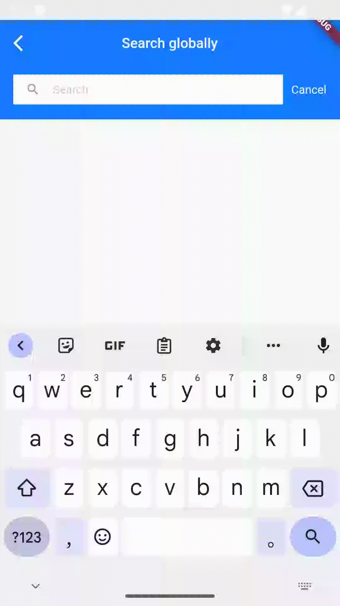
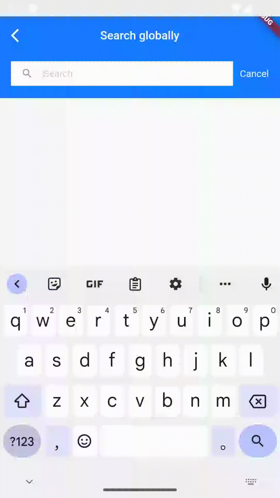

# TIMUIKitSearch

## 组件介绍及使用场景 <a href="#he-shi-shi-yong" id="he-shi-shi-yong"></a>

组件介绍：uikit搜索组件。

使用场景：根据关键字搜索用户、群组、聊天记录时使用。

## 参数列表

| 参数                          | 说明                             | 类型                                                                                                                   | 是否必填 |
| --------------------------- | ------------------------------ | -------------------------------------------------------------------------------------------------------------------- | ---- |
| onTapConversation           | 点击用户模块、群组模块、搜索详细聊天记录内信息模块的回调函数 | Function([V2TimConversation](../../api/guan-jian-lei/message/v2timconversation.md), V2TimMessage?)                   | 是    |
| onEnterSearchInConversation | 点击聊天历史模块的回调函数                  | Function([V2TimConversation](../../api/guan-jian-lei/message/v2timconversation.md) conversation, String initKeyword) | 是    |

## 代码示例与效果展示

### onTapConversation

onTapConversation为点击用户模块、群组模块、搜索详细聊天记录内信息模块的回调函数。

* 代码示例为使用自定义onTapConversation做到点击用户跳转到用户聊天页面、点击群组跳转到群组聊天页面、点击详细聊天记录内信息模块进入聊天页面的示例。

#### 代码示例

```dart
  @override
  Widget build(BuildContext context) {
    final isConversation = (conversation != null);
    final TIMUIKitConversationController _conversationController =
        TIMUIKitConversationController();
    void _handleOnConvItemTapedWithPlace(V2TimConversation? selectedConv,
        [V2TimMessage? toMessage]) async {
      await Navigator.push(
          context,
          MaterialPageRoute(
            builder: (context) => Chat(
              selectedConversation: selectedConv!,
              initFindingMsg: toMessage,
            ),
          ));
      _conversationController.reloadData();
    }

    final theme = Provider.of<DefaultThemeData>(context).theme;
    return Scaffold(
      appBar: AppBar(
        iconTheme: const IconThemeData(
          color: Colors.white,
        ),
        elevation: 0,
        backgroundColor: theme.primaryColor,
        title: Text(
          isConversation
              ? (conversation?.showName ??
                  conversation?.conversationID ??
                  imt("相关聊天记录"))
              : imt("全局搜索"),
          style: const TextStyle(
            color: Colors.white,
            fontSize: 17,
          ),
        ),
      ),
      body: isConversation
          ? TIMUIKitSearchMsgDetail(
              currentConversation: conversation!,
              onTapConversation: _handleOnConvItemTapedWithPlace,
              keyword: initKeyword ?? "",
            )
          : TIMUIKitSearch(
              onEnterSearchInConversation:
                  (V2TimConversation conversation, String keyword) {
                Navigator.push(
                    context,
                    MaterialPageRoute(
                      builder: (context) => Search(
                        onTapConversation: _handleOnConvItemTapedWithPlace,
                        conversation: conversation,
                        initKeyword: keyword,
                      ),
                    ));
              },
              onTapConversation: _handleOnConvItemTapedWithPlace,
              conversation: conversation,
            ),
    );
  }
```

#### 效果展示

  

### onEnterSearchInConversation

onEnterSearchInConversation为点击聊天历史模块的回调函数。

* 代码示例为使用自定义onEnterSearchInConversation做到点击聊天历史模块进入搜索详细聊天记录页面的示例。

#### 代码示例

```dart
  @override
  Widget build(BuildContext context) {
    final isConversation = (conversation != null);
    final TIMUIKitConversationController _conversationController =
        TIMUIKitConversationController();
    void _handleOnConvItemTapedWithPlace(V2TimConversation? selectedConv,
        [V2TimMessage? toMessage]) async {
      await Navigator.push(
          context,
          MaterialPageRoute(
            builder: (context) => Chat(
              selectedConversation: selectedConv!,
              initFindingMsg: toMessage,
            ),
          ));
      _conversationController.reloadData();
    }

    final theme = Provider.of<DefaultThemeData>(context).theme;
    return Scaffold(
      appBar: AppBar(
        iconTheme: const IconThemeData(
          color: Colors.white,
        ),
        elevation: 0,
        backgroundColor: theme.primaryColor,
        title: Text(
          isConversation
              ? (conversation?.showName ??
                  conversation?.conversationID ??
                  imt("相关聊天记录"))
              : imt("全局搜索"),
          style: const TextStyle(
            color: Colors.white,
            fontSize: 17,
          ),
        ),
      ),
      body: isConversation
          ? TIMUIKitSearchMsgDetail(
              currentConversation: conversation!,
              onTapConversation: _handleOnConvItemTapedWithPlace,
              keyword: initKeyword ?? "",
            )
          : TIMUIKitSearch(
              onEnterSearchInConversation:
                  (V2TimConversation conversation, String keyword) {
                Navigator.push(
                    context,
                    MaterialPageRoute(
                      builder: (context) => Search(
                        onTapConversation: _handleOnConvItemTapedWithPlace,
                        conversation: conversation,
                        initKeyword: keyword,
                      ),
                    ));
              },
              onTapConversation: _handleOnConvItemTapedWithPlace,
              conversation: conversation,
            ),
    );
  }
```

#### 效果展示

.gif>)
